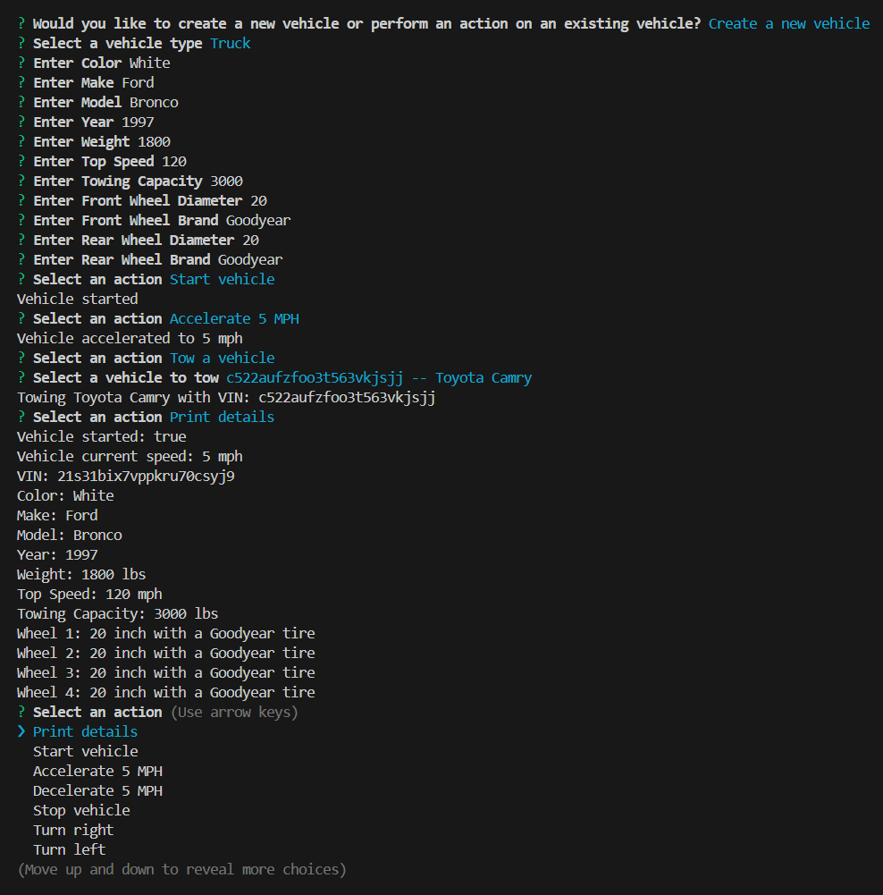

# Vehicle Builder in CLI

## Description

The Vehicle Builder CLI is a Command Line Interface (CLI) application that enables users to build and manage various types of vehicles, including cars, trucks, and motorbikes. Users can create custom vehicles from scratch or load previously created ones. Once a vehicle is created, users can perform various actions on it and view its details. The application is built with [Node.js](https://nodejs.org/en) and TypeScript, and uses [Inquirer.js](https://www.npmjs.com/package/inquirer) for interactive command-line prompts.

## Features

* Create new vehicles (Car, Truck, Motorbike)
* Perform actions on vehicles:
  - Print details
  - Start vehicle
  - Accelerate
  - Decelerate
  - Stop vehicle
  - Turn right
  - Turn left
  - Reverse
  - Tow a vehicle (Truck only)
  - Do a wheelie (Motorbike only)__
* View details of existing vehicles

## Table of Contents

- [Description/Features](#description)
- [Installation](#installation)
- [Usage](#usage)
- [Deployment](#deployment)
- [Contributing](#contributing)
- [License](#license)
- [Media](#media)

## Installation

Before running the application, follow these steps:

  1. Ensure you have [Node.js](https://nodejs.org/en) and [npm](https://www.npmjs.com/) installed.

  2. Clone the repository and navigate to the project directory.

  3. Install the dependencies using the command-line command:
  
   ``` npm install```
   
## Usage

To initialize the application:

  1. Build and start  project with the command-line command:
   
   ```npm start```
    
  2. Follow the prompts to create new vehicles or perform actions on existing vehicles.

## Deployment

The application runs in the command-line interface/terminal.

## License

This project is licensed under the MIT license.


## Media

### Screenshot



### Video

[Watch the application in action](https://drive.google.com/file/d/1Uhj_KDlO9AlU-jyA5iuRQq3wCCBoiRhS/view?usp=sharing)
